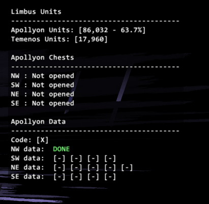
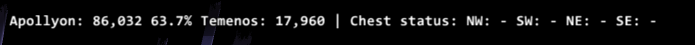

# Units

## What is Units?

* Units is a addon that tracks your total Temenos/Apollyon Units and shows the diff percentage until you're cap. 

* Automatically tracking your temp items for Code and floor data.

* It will warn you when you're getting close so you're not losing out on Units when you open a chest.

* It will warn you if you're nearing full inventory when you open a chest, that drops may be lost if you don't make room before leaving the area.

* It will detect automatically if you found a normal or bonus chest - No need to track that anymore manually.

* Resets tracking status on Chests on weekly reset.

## Notice on Packets

This  addon reads and sends a single client request packet (`0x115`) to refresh your Limbus Unit totals.

This is the same packet the game client sends when you open the currency menu - nothing is being modified or altered. 

## Commands

`//units show | hide` - Display | Hide the HUD

`//units mini | full` - Toogle between mini and full HUD

## Demo

### Full HUD

### Mini HUD

